# 软著申请流程 #
## 1.准备工作 ##
准备好3个附件里的文档。附件1内包括软件设计说明书+使用说明书+源代码.附件2为浙江理工大学软件著作权申请表，需要学院、科技处、学校的章。附件3为浙江理工大学科研成果知识产权实施协议，需要导师签字、科技处盖章。
## 2.网上申请 ##
1）登录中国版权保护中心http://apply.ccopyright.com.cn/cpcc/column_list_bqdj.jsp并进行注册，登录进去后点击“我要登记”。
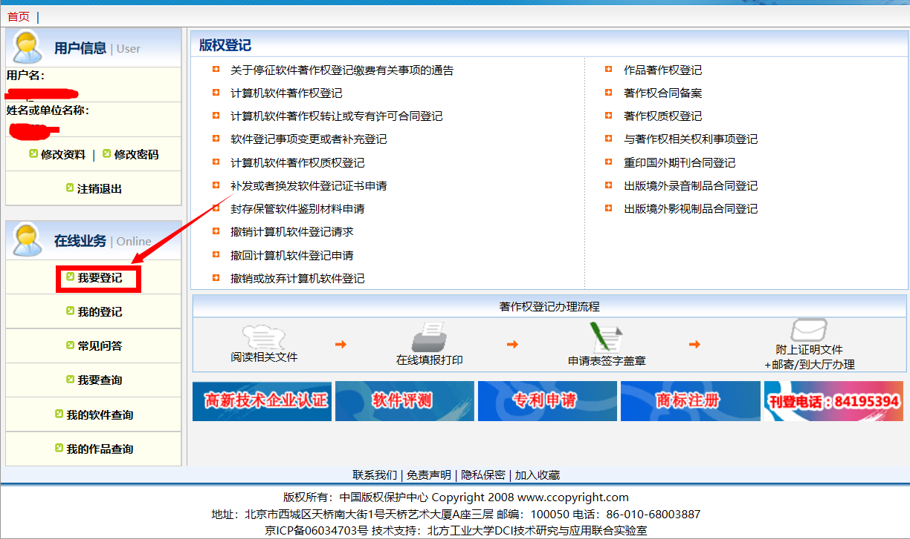
2）点击“R11.计算机软件著作权登记申请”
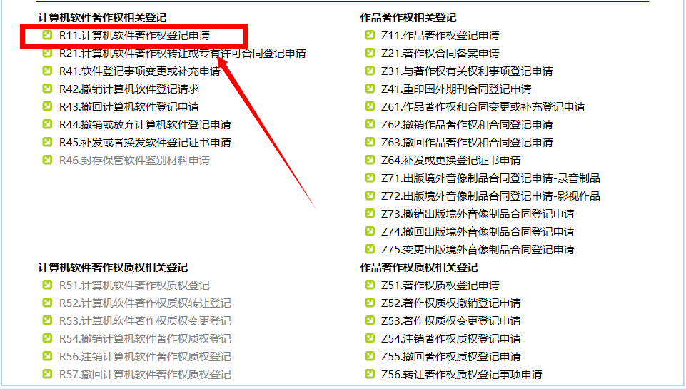
3) 弹出一个窗口进行信息填写（主要参照准备工作中的文档进行填写）。
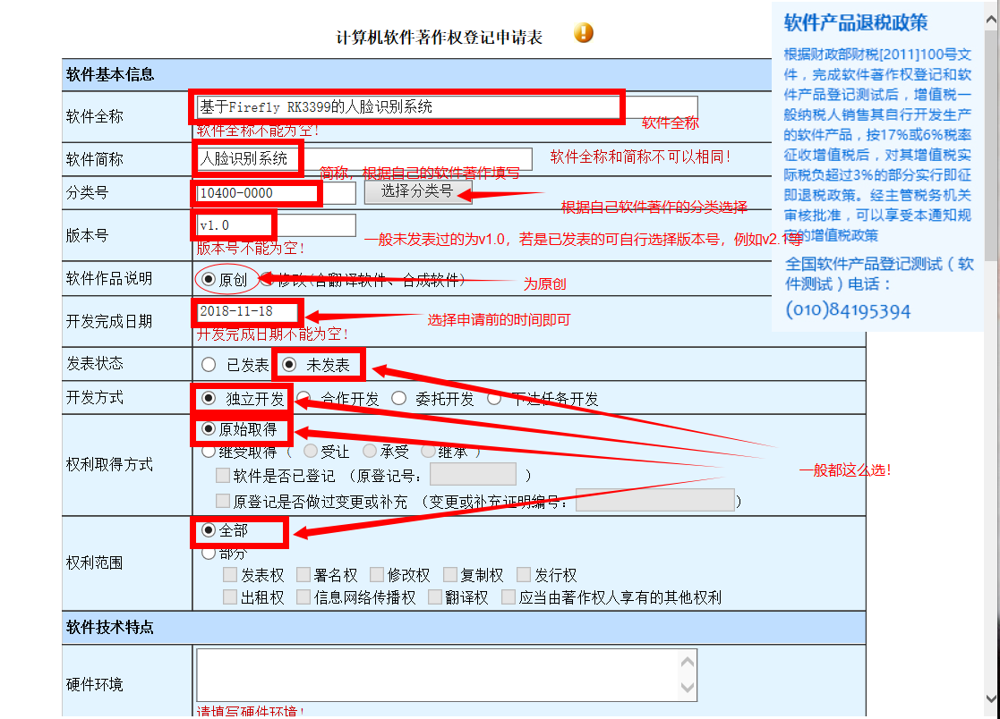
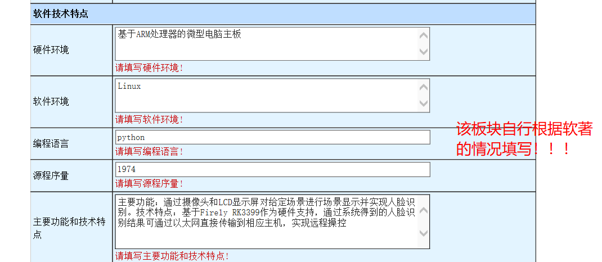
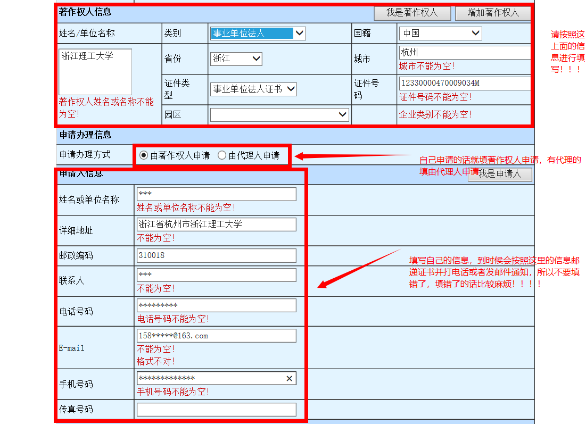
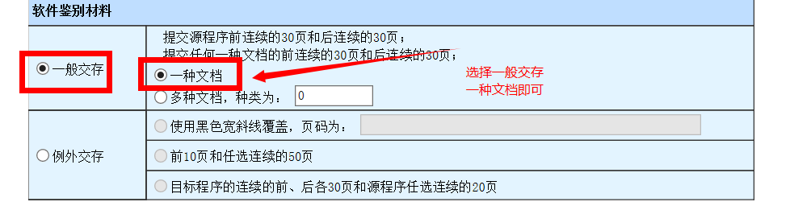
4) 最后保存一下以上信息
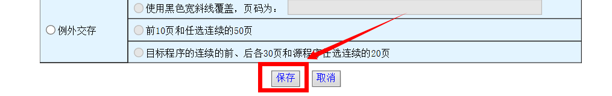
5）提交申请，先提交申请再回来打印。在我的登记中找到刚刚保存的信息。（以某位学姐的基于Firefly RK3399的人脸识别系统为例）
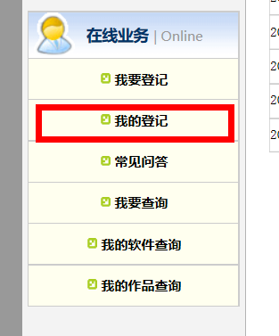

6）点击录入信息中的查看，会弹出一个窗口然后核对自己的信息，在信息的最后有一份申请材料清单，这是最后要交到中国版权中心的材料。核对完信息后确定无误，就可以按最上面的“确认提交”按钮。
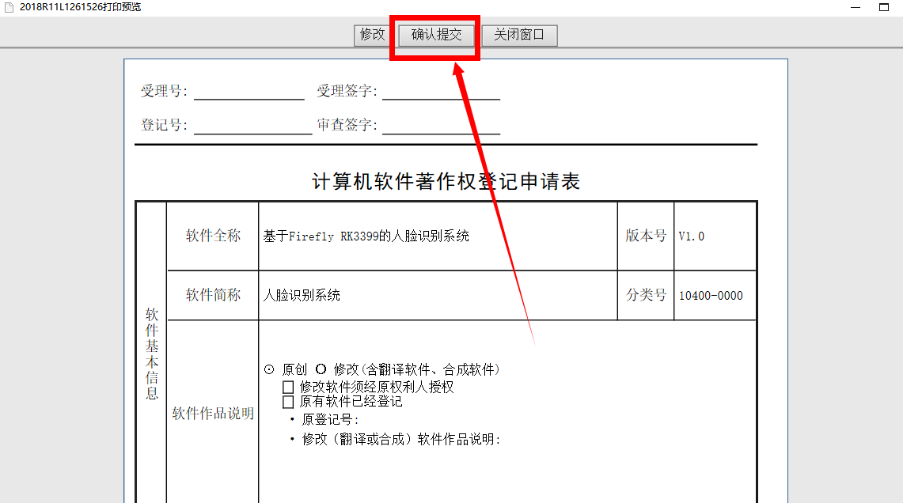
7）接着是打印。一页一个流水号（一共是四页，单面打印），一式两份。
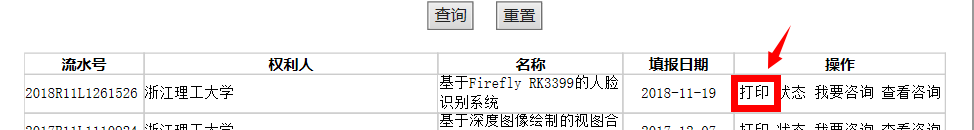
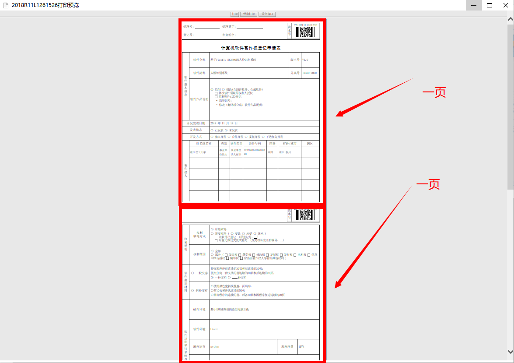
## 附件相关 ##
附件1：软件设计说明书主要包括该软件的编写目的和解决方法、开发背景、系统结构、功能模块介绍、实现流程等。最好有5-10页。
使用说明书是针对该软件的使用进行说明，可以包括打开——常用功能——特殊功能——实现效果等截图。
源代码就是把该软件的代码复制粘贴部分或者全部至文档中。
附件2：表中的著作权人写学校、说明书摘要部分简略概括一下你系统的功能、代理机构部分自己申请的话一般为无委托外部申请的话填该公司名称、所在学院意见需要找10号楼3楼的蒋明峰老师签字以及隔了两个办公室的另一位管学院章的老师盖章。主管部门意见需要行政楼（一号楼）428科研院办公室盖章。科技处会给你一张用来盖学校公章的小纸条以及学校的事业单位法人证书复印件。附件2会被科技处留下存档。PS只要打印1份
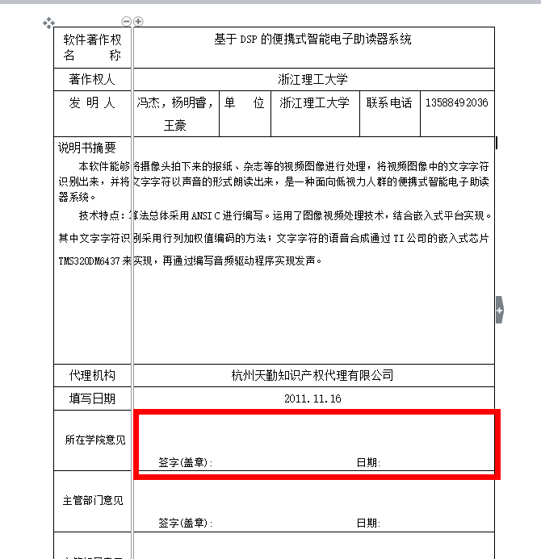
附件3：主要是对该软件著作权的日后使用做一个约定。在乙方部分写导师，签字也是导师签字。然后是行政楼（一号楼）428科研院办公室盖章。PS：打印两份，一份上交科技处留档，一份自己存着。
附件2和3都是为了在申请表上盖上学校的公章以及事业单位法人证书复印件。
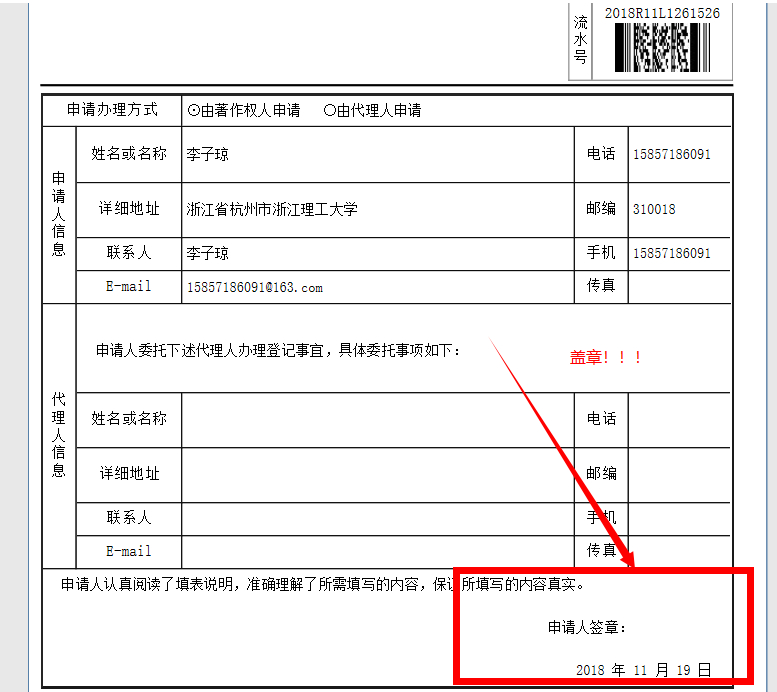
材料邮寄前查看一下是否有遗漏
**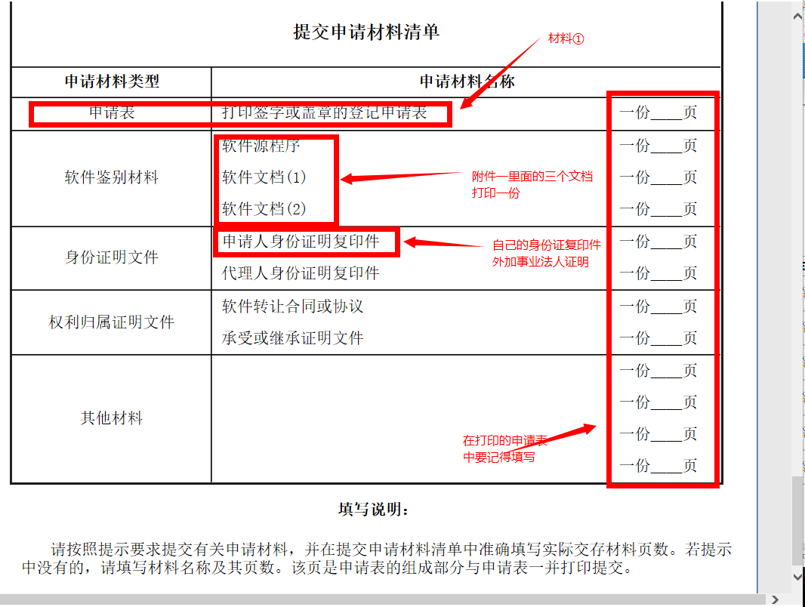**
**邮寄信息为地址：北京市西城区天桥南大街1号天桥艺术大厦A座三层 邮编：100050 电话：86-010-68003887**
